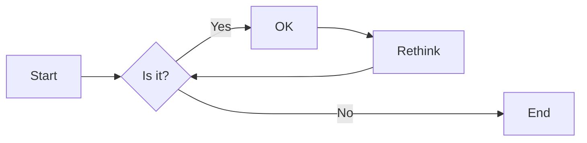
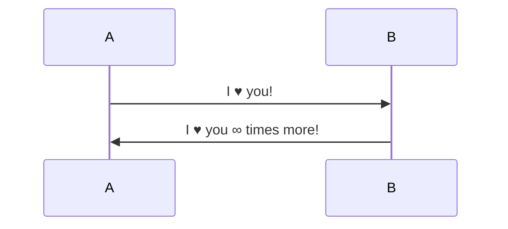

# Test file with some characteristics (Header 1)

{{TOC}}

## Usual markdown objects

### Text in paragraph

Here there is some text in *italic* and some in **bold** and link to my personal page [Personal Page](http://www.fisoft.es).
We can also add some image .

And continue with some different ==highlights== in the text, or if you want to correct a partner, you can ~~strikethrough~~ some text.

### Horizontal Rule

---

### Lists

#### Bullet list (*)
* List
* List
* List

#### Bullet list (-)
- List
- List
- List

#### Numerical list (n.)
1. One
2. Two
3. Three

#### Tasks Lists

- [ ] Unfinished task list item
- [ ] Another unfinished task
- [x] Finished task list item

### BlockQuote
> Normal BlockQuote

and big one

> BlockQuote with some several text that could be written in this textbox and with some different lines.
> And you can continue in a new line and add also some format like **a bold text** and *italics*.

and quote to quote to quote....
> This is the big quote
>> And quote inside a quote

### Code Blocks
#### Without code specification
```
This is code block normal with standard format
and it could be used, for example to represent an output from an execution in a command shell
```

#### With code highlighting
```language-python
#This one has "language-python" as mark up in the code block
#and let's format it. (be aware of wrap lines!)

import numpy as np
import pandas as pd
import matlplotlib.pyplot as plt

df = pd.read("hola.csv",sep=";")
root = np.sqrt(25)

class sergiiatemplate:
    super():
        print("I'm python code")
```

### Table
|Header |Column 1 | Column 2 | Column 3  | 
|:--- |:---- |:----:| ----:|
|1. Row| is | is | is  |
|2. Row| left | nicely | right  |
|3. Row| aligned | centered | aligned  | 

### Mathematical
An example of math inline ${e}^{i\pi }+1=0$

To show an expression by itself with double dollar:

$${x}_{1,2}=\frac{-b\pm \sqrt{{b}^{2}-4ac}}{2a}$$

## Plugins Add-ons

This plugins are managed through code block mark-up.

### Mermaid Plugin
[Mermaid Home Page](https://mermaid-js.github.io/mermaid/#/)





### Chart.js graph

[Chart.js Home page](https://www.chartjs.org/)

```chartgraf
    {
      "type": "pie",
      "data": {
        "labels": [
          "Red",
          "Blue",
          "Yellow"
        ],
        "datasets": [
          {
            "data": [
              300,
              50,
              100
            ],
            "backgroundColor": [
              "#FF6384",
              "#36A2EB",
              "#FFCE56"
            ],
            "hoverBackgroundColor": [
              "#FF6384",
              "#36A2EB",
              "#FFCE56"
            ]
          }
        ]
      },
      "options": {
        "responsive": "false",
        "animation": "false"
        }
    }
```

### Chartist.js
[Chartist.js home page](https://gionkunz.github.io/chartist-js/)

```chartist
    {
      labels: ["Jan", "Feb", "Mar", "Apr", "May", "Jun", "Jul", "Aug", "Sep", "Oct", "Nov", "Dec"],
      series: [
        [5, 4, 3, 7, 5, 10, 3, 4, 8, 10, 6, 8],
        [3, 2, 9, 5, 4, 6, 4, 6, 7, 8, 7, 4]
      ]
    }
```
### Plotly.js
```plotly
{
  x: [1, 2, 3, 4, 5],
  y: [1, 2, 4, 8, 16] 
}
```
<!-- 
### Flowchart.js
[Flowchart Home Page](https://flowchart.js.org/)

```flow
    st=>start: Need something to be translated!
    e=>end: Be happy!
    cond=>condition: Are you a client or a translator?
    subc=>subroutine: Why should you choose a localistar?
    subt=>subroutine: Why should you become a localistar?
    op=>operation: Check out how it works!
    io=>inputoutput: Work together with your partner

    st->cond
    cond(no@client)->subc->op->io->e
    cond(yes@translator)->subt->op->io->e
```
-->