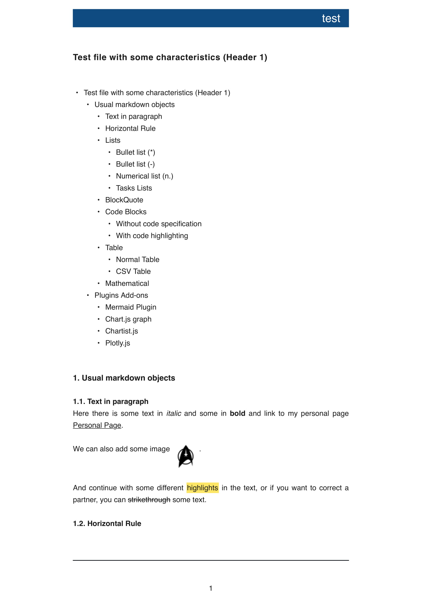

# IA Writer personal Template
I have created this template for personal use.

## Plugins included
- Mermaid
- Math Latex Syntax (native in iawriter 5)
- Chartist - only Bars at the moment
- Chart.js
- Plotly.js

## Other features
- Nice Title Page
- Some changes over footer page adding full line
- Customized Zebra blue table

## Installation 
Download last release with your Ipad and IA Writter application (if not unzip and an open the .iatemplate file)

[Release v1](https://github.com/f1se4/fiser_iatemplate/releases/download/v1.0/fiser.iatemplate.zip)

## Output

### Raw data
[Markdown Test Page](https://raw.githubusercontent.com/f1se4/fiser_iatemplate/master/test.md)

### Images of the output

